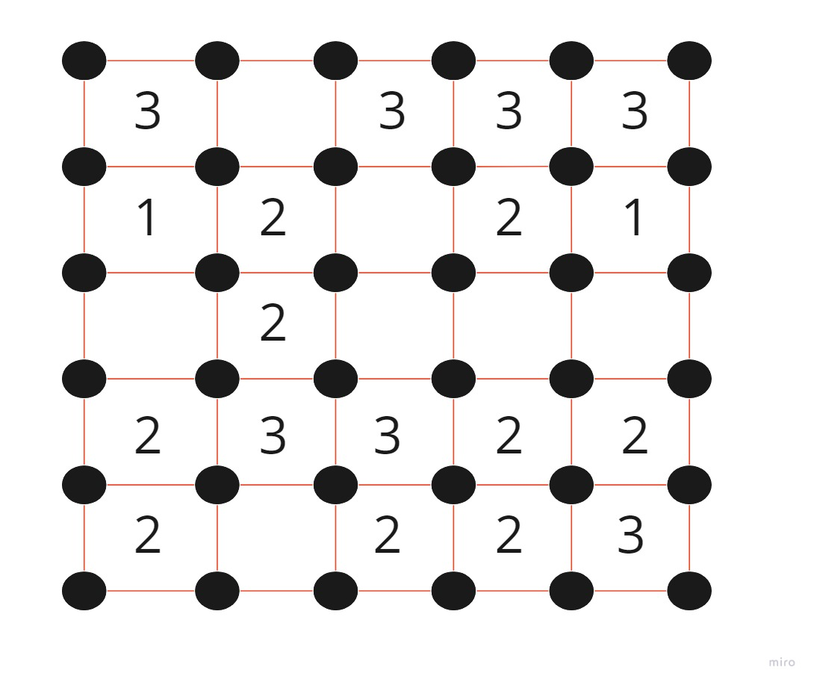

__Dots game__ 

Connect all the dots in the corners of the squares by drawing a continuous line. The line may consist only of vertical and horizontal segments.
If a square contains a number, then this is the exact number of its sides which have to be included in the line.
If a square does not contain any number, then an arbitrary number of its sides may be included in the line. 
 
